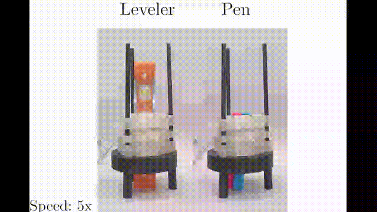

# Bio-Inspired Modular Pneumatic Actuator for Peristaltic Transport

## Overview

This projects introduces a bio-inspired soft robotic actuator for object transport through perstalitic process. 

  

## Simulations files 
Please find our simulations files here: https://drive.google.com/drive/folders/1SsrhAsbxI_-phNl0O316Vk6F6cME5XoY?usp=sharing
